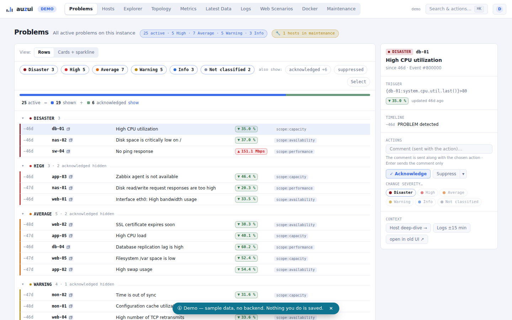
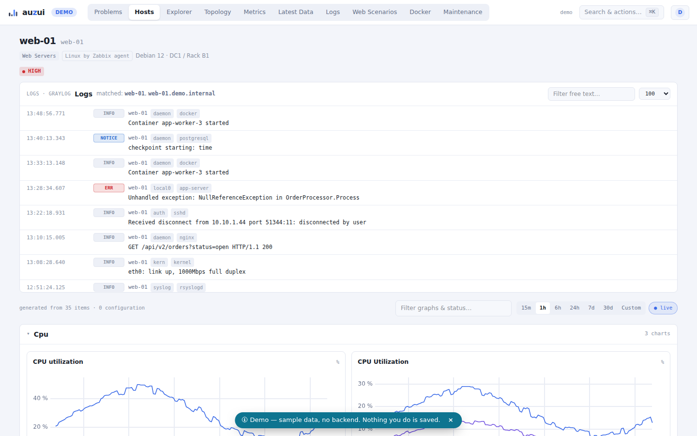
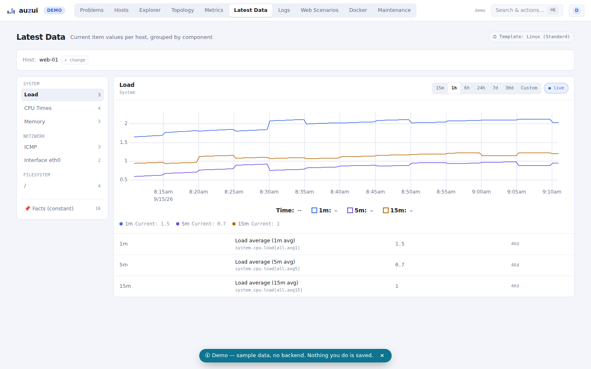
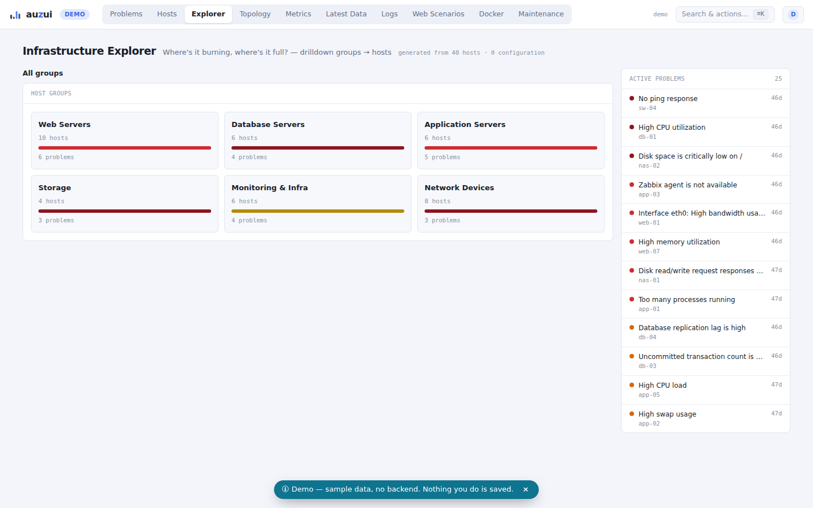
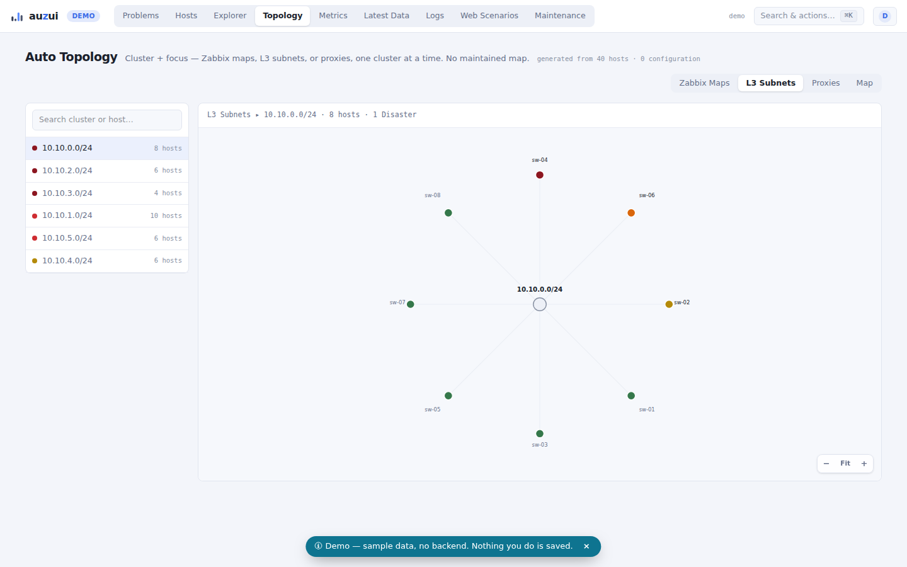
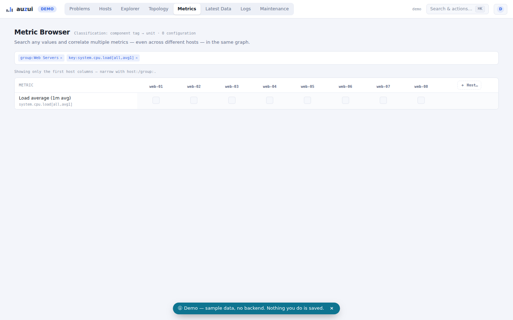
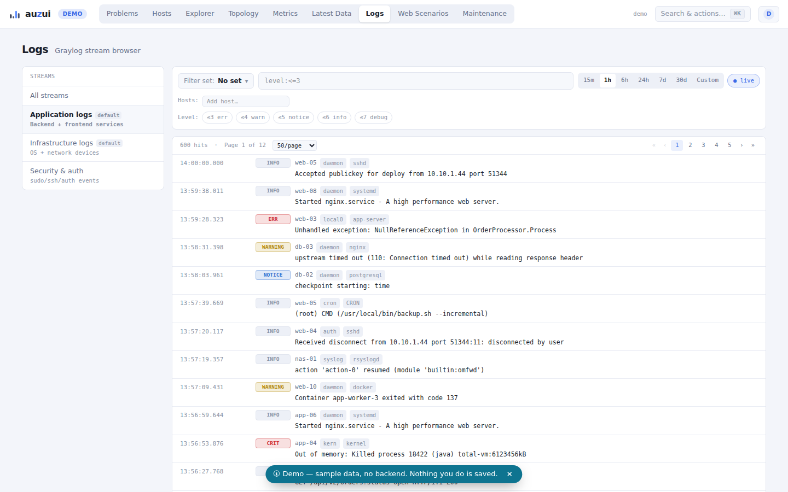
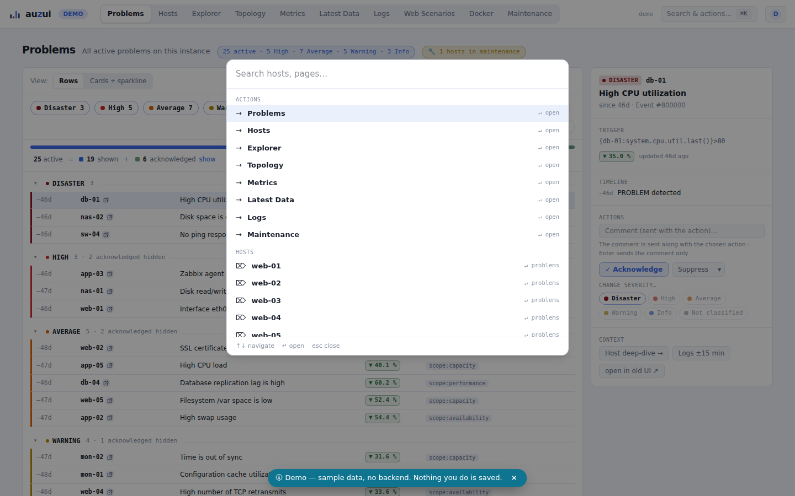

# auzui — A Usable Zabbix UI

[](./LICENSE)
[](https://github.com/cygnusnetworks/auzui/actions/workflows/ci.yml)
[](https://github.com/cygnusnetworks/auzui/pkgs/container/auzui)
[](./frontend)
[](./services/gateway)
[](https://cygnusnetworks.github.io/auzui/)

**auzui** is a modern, self-hosted monitoring single-page application that
runs **next to** your existing [Zabbix](https://www.zabbix.com/) web UI —
not instead of it. Configuration and administration stay in the classic
Zabbix UI for now; auzui focuses entirely on the monitoring workflows that
benefit most from a rebuilt, fast, dense, dark-mode-first interface:
Problems triage, Host deep-dives, Latest Data, auto-generated dashboards,
and infrastructure exploration — all driven by Zabbix's existing
JSON-RPC API.

The guiding principle is **Zero-Config Deep Observability**: auzui derives
as much as it can automatically from what Zabbix already knows (item tags,
units, templates, trigger expressions, LLD, inventory) instead of asking
operators to configure dashboards, panels, or thresholds by hand.

## Screenshots

Live, click-through demo (mocked data, no backend required):
**[cygnusnetworks.github.io/auzui/demo](https://cygnusnetworks.github.io/auzui/demo/)**.

| | |
|---|---|
|  **Problems** — live triage board |  **Host detail** — auto-generated dashboard |
|  **Latest Data** |  **Explorer** — heatmap drill-down |
|  **Topology** — dependency graph |  **Metrics** — faceted metric browser |
|  **Logs** — Graylog-backed log panel (optional) |  **⌘K** — command palette |

## Why auzui

The stock Zabbix web UI (`ui/` in the Zabbix source tree) is a large,
~1,700-file PHP monolith — its own MVC, hundreds of controllers, jQuery and
hand-rolled ES6, no build system, server-rendered PNG graphs. It is
functionally complete but shows its age in day-to-day monitoring use.
auzui is a greenfield rebuild of the *monitoring* surface — Problems,
Hosts, Latest Data, dashboards, topology — with modern navigation, native
charts, a command palette, and a UI built for high information density and
fast triage.

## Features

- **Problems as a live triage board** — virtualized list, inline
  acknowledge/comment without modal cascades, severity filter chips, bulk
  actions, a URL-addressable side panel instead of a popup (filters are
  shareable links).
- **Host Deep-Dive auto-dashboards** — a fully generated per-host dashboard:
  sections by component class, trigger thresholds rendered as chart zones,
  an interface/port matrix, storage & certificate forecasts, 7-day ghost
  lines — with **zero manual dashboard configuration**.
- **Infrastructure Explorer** — heatmap drill-down from host groups → host
  tiles → component tiles → item, colored by status or utilization, with a
  "top movers" sidebar at every level.
- **Auto-Topology** — a force-directed dependency graph built from trigger
  dependencies, LLDP/CDP neighbors, shared subnets, and statistical event
  correlation, each edge tagged with its evidence layer and confidence.
- **Metric Browser** — faceted search across every item (component tag,
  unit, template, group), a small-multiples wall sortable by deviation from
  baseline, with multi-select overlay comparison across hosts.
- **⌘K command palette** — global search over hosts/items/triggers/
  dashboards plus actions ("Ack problem…", "Go to host…"), replacing deep
  menu navigation.
- **Dark-mode first**, high information density, consistent severity color
  semantics, skeleton loading instead of spinners.
- *Optional:* **InfluxDB fast path** for time-series (via an `effluence`
  export) — see [Time-series sources](#time-series-sources) below.
- *Optional:* **Graylog logs** — a stream browser and host-scoped log panel
  synced to the same time range as the charts, entirely feature-gated.

## Architecture

```
┌──────────────────────────────────────────────────────────────┐
│  auzui SPA (React + TS, Vite)                                │
│  TanStack Router/Query · shadcn/ui · uPlot                   │
└──────────┬────────────────────┬──────────────────┬───────────┘
           │ JSON-RPC (Bearer)  │ /api/ts          │ /api/logs (opt.)
           ▼                    ▼                  ▼
  api_jsonrpc.php        auzui-gateway (optional, small)
  (existing PHP UI,      – Flux aggregateWindow ("N points over range")
   run headless)         – hides the Influx token
                          – optional: Graylog proxy (token, streams, search)
           │                    │                  │
           ▼                    ▼                  ▼
   PostgreSQL/Timescale     InfluxDB 2         Graylog REST API
                            (effluence)        (streams + search)
```

The existing Zabbix web UI is kept running as a **headless API backend**
(its JSON-RPC layer lives in the PHP frontend, not the C server — auzui
does not reimplement it). `auzui-gateway` is needed for the optional
integrations — InfluxDB time-series, Graylog logs, and Kerberos/SPNEGO
SSO; without it, the SPA talks straight to `api_jsonrpc.php` with
password login and everything else still works. Full breakdown:
[docs/architecture.md](./docs/architecture.md).

## Time-series sources

auzui reads time-series through a `TimeseriesSource` abstraction with two
implementations:

- **`ZabbixApiSource`** (default, always available) — `history.get` for
  short/recent ranges, `trend.get` for longer windows. Serves Latest
  Data, sparklines, and chart ranges directly from the Zabbix API.
- **`InfluxSource`** (optional, primary when configured) — routes through
  `auzui-gateway` to a Flux `aggregateWindow` query, downsampled
  server-side. Recommended for long ranges and dense multi-item
  dashboards.

auzui is fully usable without InfluxDB; with an `effluence` export
configured, charts cover arbitrary ranges with server-side downsampling.
Details, the effluence schema, and the Flux query reference:
[docs/timeseries-sources.md](./docs/timeseries-sources.md).

## Monorepo layout

```
frontend/                 Vite + React 19 + TypeScript SPA
packages/
  zabbix-client/           typed JSON-RPC client
  timeseries/              TimeseriesSource abstraction (Zabbix + Influx) + LTTB
  logs/                    LogSource abstraction (Graylog), optional
services/
  gateway/                 auzui-gateway (FastAPI) — optional Influx/Graylog proxy
docs/                      architecture, deployment, time-series notes
site/                      static product page (GitHub Pages)
```

## Run with Docker

One image contains the gateway **and** the built SPA (served by the
gateway, single origin). Only `ZABBIX_API_URL` is required:

```bash
docker run -d --name auzui \
  -p 127.0.0.1:8080:8000 \
  -e ZABBIX_API_URL=https://zabbix.example.com/api_jsonrpc.php \
  ghcr.io/cygnusnetworks/auzui:latest
# alternatively, the same image from Docker Hub:
#   cygnusnetworks/auzui:latest
```

The same image is published to both
[ghcr.io/cygnusnetworks/auzui](https://github.com/cygnusnetworks/auzui/pkgs/container/auzui)
and [Docker Hub (`cygnusnetworks/auzui`)](https://hub.docker.com/r/cygnusnetworks/auzui)
(`linux/amd64` + `linux/arm64`); tags: `latest` (main), `stable` +
`X.Y.Z` + `X.Y` (release tags).

For docker compose, copy
[`docker-compose.example.yml`](./docker-compose.example.yml) to
`docker-compose.yml` and adjust:

```yaml
services:
  auzui:
    image: ghcr.io/cygnusnetworks/auzui:latest
    # alternatively: cygnusnetworks/auzui:latest (Docker Hub)
    restart: unless-stopped
    ports:
      # Bind to localhost; put a reverse proxy (nginx/traefik) in front
      # for TLS and external access.
      - "127.0.0.1:8080:8000"
    environment:
      ZABBIX_API_URL: "https://zabbix.example.com/api_jsonrpc.php"
      # Optional integrations (all feature-gated, see docs/configuration.md):
      # INFLUX_URL / INFLUX_TOKEN / INFLUX_ORG   — InfluxDB time-series
      # GRAYLOG_URL / GRAYLOG_TOKEN              — Graylog log panels
      # SPNEGO_ENABLED / KRB5_KTNAME             — Kerberos SSO
```

InfluxDB and Graylog stay disabled until their variables are set; the
corresponding UI surfaces hide themselves. Reverse-proxy pattern with the
recommended security headers: [docs/deployment.md](./docs/deployment.md).

## Development quickstart

Prerequisites: Node ≥ 22, [pnpm](https://pnpm.io/) (version pinned via
`packageManager` in `package.json`), and [uv](https://docs.astral.sh/uv/)
for the optional gateway.

```bash
# Frontend + workspace packages
pnpm install
pnpm dev            # runs the frontend/ dev server

# Optional: auzui-gateway (only needed for InfluxDB/Graylog)
uv sync --package auzui-gateway --extra dev
uv run uvicorn auzui_gateway.main:app --reload --host 0.0.0.0 --port 8080
```

Or with [just](https://github.com/casey/just):

```bash
just install
just dev            # frontend
just gateway-dev     # gateway
just lint
just test
just build
```

Configuration reference (Zabbix/Influx/Graylog env vars, nginx pattern,
security notes): [docs/deployment.md](./docs/deployment.md) and
[docs/configuration.md](./docs/configuration.md). Full documentation index:
[docs/README.md](./docs/README.md).

## Links

- **Product site:** [cygnusnetworks.github.io/auzui](https://cygnusnetworks.github.io/auzui/)
- **Live demo:** [cygnusnetworks.github.io/auzui/demo](https://cygnusnetworks.github.io/auzui/demo/)
  (mocked data, no Zabbix/gateway required)
- **Documentation index:** [docs/README.md](./docs/README.md)

## Clean-room statement

auzui is an **independent, clean-room implementation** built purely
against Zabbix's documented JSON-RPC API contract. It contains **no
Zabbix source code**. The existing Zabbix web UI is treated as an opaque,
already-installed backend service that auzui talks to over HTTP — it is
never read, copied, or forked. See [NOTICE.md](./NOTICE.md) for the full
licensing and trademark statement.

## Contributing

1. Open an issue or discuss the change before large design work.
2. Keep documentation, user-facing strings, and code comments in English.
3. Do not copy any Zabbix source into the tree.
4. Run `just lint` and `just test` before opening a PR.

## License

auzui is licensed under the **GNU Affero General Public License v3.0**
(AGPL-3.0-only) — see [LICENSE](./LICENSE). See [NOTICE.md](./NOTICE.md)
for the clean-room statement and trademark notes.

Copyright © 2026 Cygnus Networks GmbH.

"Zabbix" is a trademark of Zabbix LLC / SIA Zabbix. auzui is not
affiliated with, endorsed by, or sponsored by Zabbix LLC/SIA; the name is
used solely to describe factual interoperability with the Zabbix JSON-RPC
API. "Graylog" and "InfluxDB" are trademarks of their respective owners and
are used solely to describe optional, factual interoperability.
